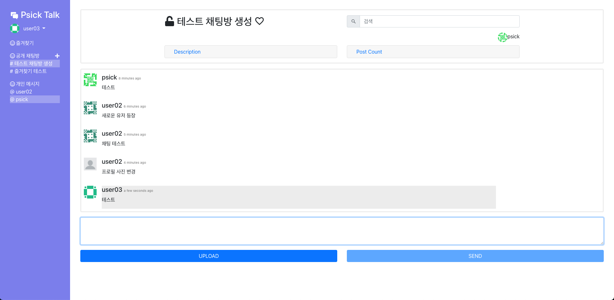
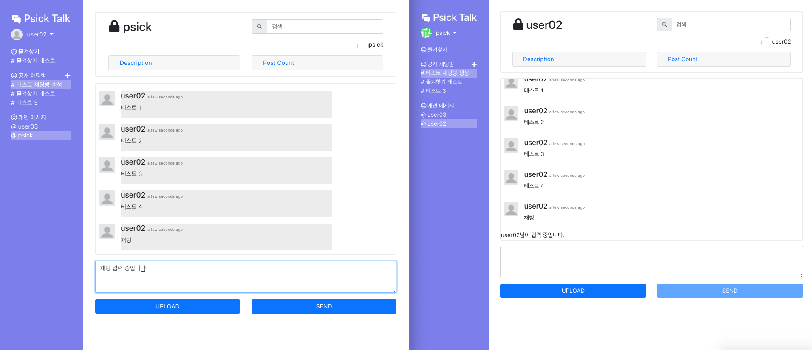

# 채팅앱 만들어보기

- React, Redux, Firebase Storge / realtime DB를 이용한 실시간 채팅앱 구현

  

## 1. 공개 채팅방

- 가입된 모든 사용자가 참여되어 있는 채팅방

## 2. 개인 메시지 (Direct message)

- 개인간 1:1 대화방

## 3. 공통 기능

### 유저 관련

- 회원가입/로그인/로그아웃 (Firebase Auth)
- 프로필 사진 설정
- 사용자 id 기반 초기 프로필 사진 랜덤 생성 후 등록

### 채팅 관련

- 내가 친 채팅 강조
- 확인하지 않은 메시지가 있는 채팅방 강조 표시

  

- 채팅방 즐겨찾기 기능
- 채팅 검색 기능
- 채팅방마다 사용자 채팅수 (비율) 확인 기능

  

- 채팅 입력 중인 유저 표시

  
